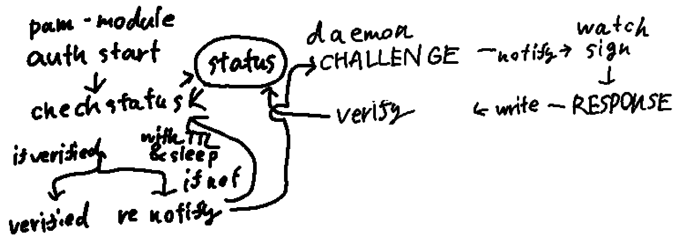

pam-moduleが一番上

check statusでdaemonのnotifyを発火

watchでチャレンジレスポンスにsign

daemonでチャレンジレスポンスを認証

ステータスに結果を書き込み (if verified -> ElapsedStatus::VERIFIED)

pam-moduleはverifyされたかわからないので

sleep+TTLつきでcheck statusを複数回トライ

TTLが0になるまでにis verifiedならsucess

if notならfail

(status)とあるけど実際にはUNIX Socketでの通信

check statusでUNIX Socketサーバー(daemon)へ通信しstatusをもらう
